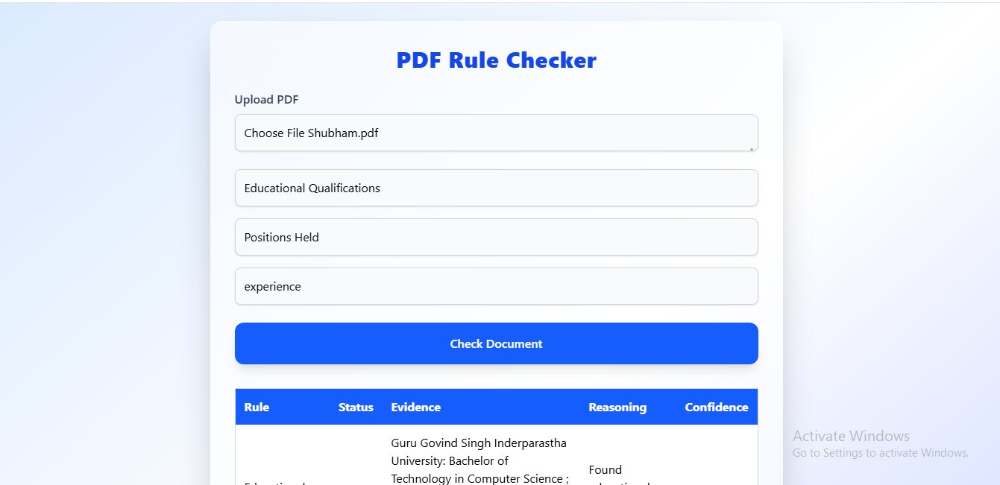

# 📄 PDF Rule Checker – Full-Stack LLM Tool

A simple and elegant web application that allows users to upload a PDF, define custom rules, and get automated PASS/FAIL evaluations using an LLM (Large Language Model).  

---

## 🚀 Features

### ✅ Frontend (React + Tailwind + Framer Motion)
- Upload PDF interface  
- Add 3 custom rules  
- Beautiful animated UI  
- Loading spinner while LLM processes  
- Results table with animations  
- Clean and intuitive user experience  

### ✅ Backend (Node.js + Express)
- Accepts PDF uploads  
- Extracts text using `pdf-parse-fixed`  
- Sends extracted text to an LLM for evaluation  
- Returns:
  - PASS / FAIL
  - Evidence sentence  
  - Short reasoning  
  - Confidence score (0–100)

---

## 🧠 How It Works

1. User uploads a PDF file  
2. User enters 3 simple rules to check  
3. Backend extracts text from the PDF  
4. LLM evaluates each rule  
5. Frontend displays results in a clean animated table  

---

## 🖼️ Screenshot




---

## 🛠️ Tech Stack

### **Frontend**
- React (Vite)
- TailwindCSS  
- Framer Motion  
- Fetch API  

### **Backend**
- Node.js  
- Express.js  
- Multer (file uploads)  
- pdf-parse-fixed (PDF text extraction)  
- OpenAI / OpenRouter API  

---

## 📦 Installation & Setup

### 🔧 Clone the repo
```sh
git clone https://github.com/coolshubhamsharma/LLm_pdf_rule_checker.git
cd pdf-rule-checker
